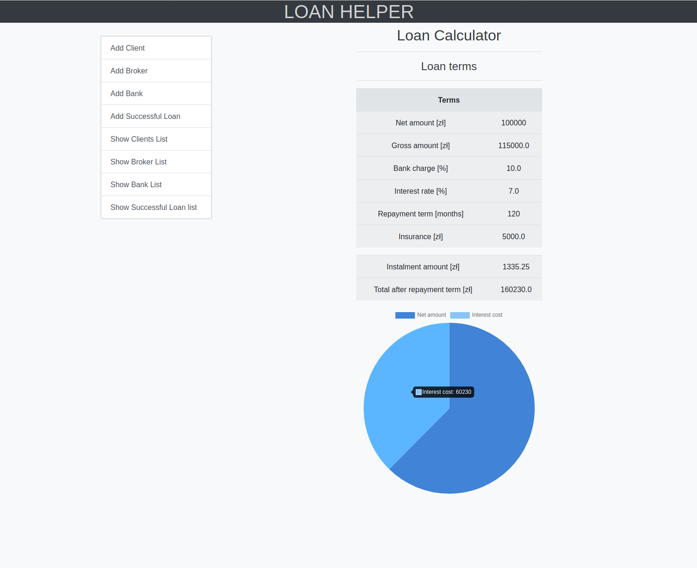
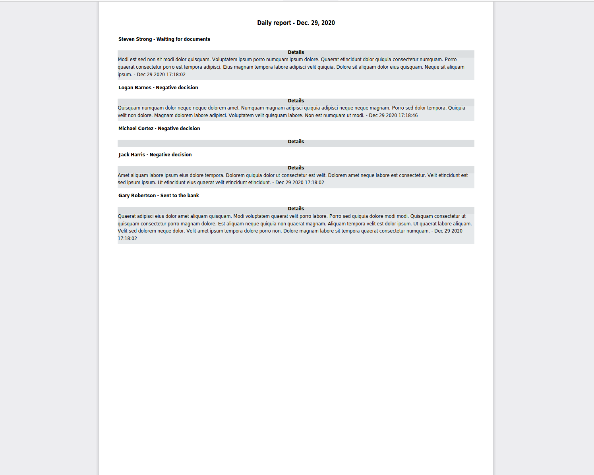

# Loan helper
> Simple web application that allows to monitor progress of customers loans.

## Table of contents
* [General info](#general-info)
* [Screenshots](#screenshots)
* [Technologies](#technologies)
* [Demo](#demo)
* [Features](#features)
* [Status](#status)
* [Inspiration](#inspiration)
* [Contact](#contact)

## General info
Like I write before, application allows to monitor progress of loans. Every customer has his own process, with hundreds of clients we can easy forget some information e.g. what status that customer have or what offer from bank he got. Trello has great functions but for me that was not enough. With this app we can track customers, add comments, calculate loans or generate report, not only for us but also for brokers who works with our company.

## Screenshots

## Technologies
* Python - version 3.7
* Django - version 3.0.6
* PostgreSQL - version 13.0
* pytest - version 5.4.2
* pytest-django - version 3.9.0
* Faker - version 4.1,0
* pytz - version 2020.1
* psycopg2-binary - version 2.8.6
* xhtml2pdf - version 0.2.5
* numpy - version 1.19.0
* Bootstrap - version 4.5.3
* Chart js - version 2.9.3

## Demo
I'm working on it.

## Features
List of features ready and TODOs for future development
* Track customers progress
* Calculate costs of loan
* Generate reports

To-do list:
* Calculating creditworthiness
* More statistics, graphs and charts

## Status
Project is: _finished_, but I may add new functions from to-do list

## Inspiration
This is my final project for Coders Lab bootcamp - Python Developer. I personally use this app in my current job. It helps me stay informed about all customers.

## Contact
Created by Emil Lech (contact@emillech.com.pl) - feel free to contact me!
